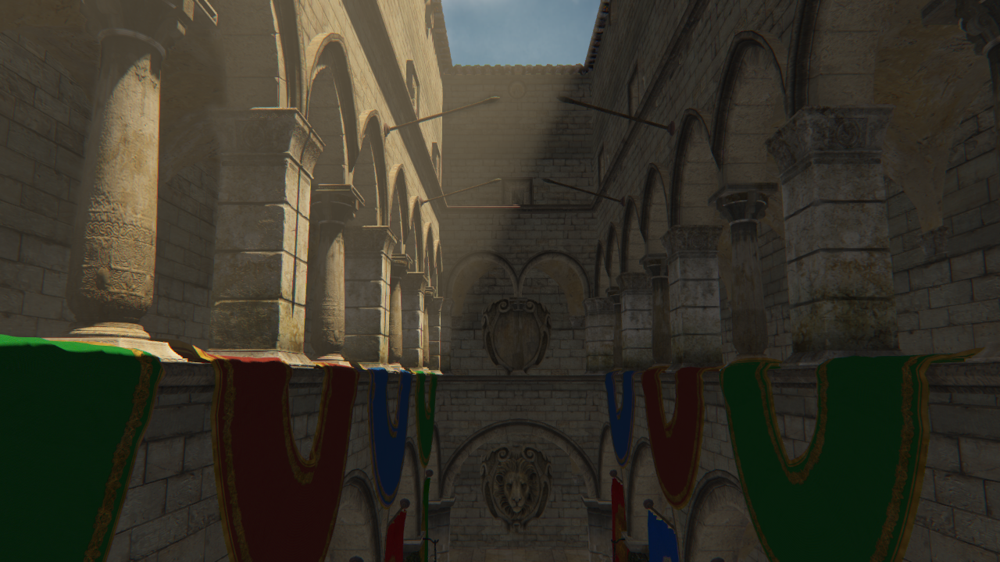

# Atlas Engine

## Introduction
This is a cross platform engine that is available on all major platforms including Linux, Windows, MacOS and Android.
>**Note:**
>MacOS only supports OpenGL up to version 4.1. Some features aren't available there.
## Requirements
- OpenGL 4.3 or higher
- OpenGL ES 3.2
## Installation
Before you start compiling make sure to download the dependencies into **./dependencies**. You can either do
this manually or use one of the available scripts. Building the engine is really convenient: You can use your
source code and project across all supported platforms. The only thing that differs are the build tools. 
>**Note:**
>Debugging the resulting application in a debug configuration will result in poor performance. 
### Linux, Windows and MacOS
The installation is done using CMake. There are two options available: Start a new project with a predefined
main file which you can edit. The second option is two use the engine as a subproject in an already existing project.
#### New project using the engine
After running CMake you can find the main file at **./src/main.cpp**. Just start your project there, it already
contains a main function.
#### Excisting project using the engine
There exist two options:
- You can use the engine as a CMake subproject. Just go ahead and use **add_subdirectory** in the root
CMakeLists.txt of your project. Afterwards add **target_link_libraries(YOUR_TARGET ... AtlasEngine)**. You should be fine.
- You can compile the engine and all dependencies as a static library (note that some dependencies also have
dynamic libraries). Therefore use the **BUILD_LIBRARY** option when using CMake.
### Android
The installation for Android is done differently. You can compile it using Gradle either with or without AndroidStudio.
The Gradle project can be found in **./platform/android**. Open it before you proceed.
There are also two options available: Start a new project with a predefined
main file which you can edit. The second option is two use the engine as a subproject in an already existing project.
#### New project using the engine
You can find the main file at **./src/main.cpp**. Just start your project there, it already
contains a main function. 
#### Excisting project using the engine
There exist two options:
- You can use the engine as a Gradle subproject.
- You can compile the engine and all dependencies as a static library (note that some dependencies also have
dynamic libraries). Therefore set the project property to **BUILD_LIBRARY**.
## Documentation
If you want more information have a look into the [Documentation](https://tippesi.github.io/Atlas-Engine/index.html)
## General performance tips
- Use static/stationary objects and lights as often as possible
- Use textures with the same size and format for each material
- Set mesh data or any kind of data prior to rendering. More importantly: Don't create data while rendering.
- Try to avoid using OpenGL, use existing engine features instead
## Code Example
Here is a small introduction to the engine
```c
#include <Engine.h>
#include <input/Mouse.h>
#include <input/Keyboard.h>

int main(int argc, char* argv[]) {

	// After initializing the engine we will get back a window object.
	// We also need to tell in which directory all the assets are, so that
	// we can use relative paths later on. Note that everything about the
	// engine is in the Atlas namespace.
	auto window = Atlas::Engine::Init("../data", "shader", "Example application",
			AE_WINDOWPOSITION_UNDEFINED, AE_WINDOWPOSITION_UNDEFINED, 1280, 720, AE_WINDOW_RESIZABLE);

	// Load an icon for the window
	auto icon = Atlas::Texture::Texture2D("icon.png");
	window->SetIcon(&icon);
	window->Update();

	// Let's set up our render target. All things get drawn to the render target
	// before they are displayed.
	auto renderTarget = Atlas::RenderTarget(1920, 1080);

	// We also need a master renderer
	auto masterRenderer = Atlas::Renderer::MasterRenderer();

	// Now create our scene
	auto scene = Atlas::Scene();

	// We want to have a camera too
	auto camera = Atlas::Camera(47.0f, 2.0f, 1.0f, 400.0f, vec3(30.0f, 25.0f, 0.0f), vec2(-3.14f / 2.0f, 0.0f));

	// Now load the meshes we later want to use to create instances of them.
	// We can add these instances of meshes, called MeshActor to our scene.
	auto sponzaMesh = Atlas::Mesh::Mesh("sponza/sponza.dae", AE_STATIONARY_MESH);
	auto treeMesh = Atlas::Mesh::Mesh("tree.dae", AE_STATIONARY_MESH);
	auto cubeMesh = Atlas::Mesh::Mesh("cube.dae", AE_MOVABLE_MESH);

	// Notice that we want to move our cube later on. All meshes where we frequently want to
	// update the positions should be AE_MOVABLE_MESH. Let's create our MeshActors then:
	auto sponzaActor = Atlas::Actor::MeshActor(&sponzaMesh);
	auto treeActor = Atlas::Actor::MeshActor(&treeMesh);
	auto cubeActor = Atlas::Actor::MeshActor(&cubeMesh);

	// We want to scale our tree because it isn't large enough
	treeActor.SetMatrix(glm::scale(mat4(1.0f), vec3(3.0f)));

	// We also want to scale the sponza model
	sponzaActor.SetMatrix(glm::scale(mat4(1.0f), vec3(0.05f)));

	// We create a scene node, which we can later move around.
	// The concept is really easy to understand: All actors of all the different types
	// which are added to that scene node translate, rotate and scale relative to the translation,
	// rotation and scale of that scene node.
	auto sceneNode = Atlas::SceneNode();

	// Notice that we add the scene node. The root node can also be translated, rotated and scaled.
	// We will use this later on.
	scene.rootNode->Add(&sceneNode);

	// Translate the scene node
	sceneNode.transformationMatrix = glm::translate(vec3(0.0f, 1.0f, 5.0f));

	// We can also add the actors to scene without adding them to a scene node.
	// This means that all actors added this way have an absolute translation, rotation and scale.
	scene.Add(&sponzaActor);
	scene.Add(&treeActor);

	sceneNode.Add(&cubeActor);

	// Let's also create a global directional light. This is also stationary for this example scene.
	auto directionalLight = Atlas::Lighting::DirectionalLight(AE_STATIONARY_LIGHT);

	// Now we can change this light to our needs
	directionalLight.direction = vec3(0.0f, -1.0f, 0.1f);
	directionalLight.ambient = 0.05f;
	directionalLight.color = vec3(253.0f, 194.0f, 109.0f) / 255.0f;

	// Shadow mapping that is fixed to a point
	mat4 orthoProjection = glm::ortho(-100.0f, 100.0f, -70.0f, 120.0f, -120.0f, 120.0f);
	directionalLight.AddShadow(200.0f, 0.01f, 4096, vec3(0.0f), orthoProjection);
	directionalLight.GetShadow()->sampleCount = 1;

	// A shadow has to be added to work
	directionalLight.AddVolumetric(renderTarget.width / 2, renderTarget.height / 2, 20, -0.5f);

	scene.Add(&directionalLight);

	// We also want to interact with our little application. We therefore create a keyboard and mouse
	// handler. The handlers which are currently present in the engine are very basic but can be seen
	// as an example on how to write your own one.
	auto mouseHandler = Atlas::Input::MouseHandler(&camera, 1.5f, 0.015f);
	auto keyboardHandler = Atlas::Input::KeyboardHandler(&camera, 7.0f, 0.3f);

	// We might also want to know when to exit the application. The engine has an event system build
	// in. We use it to catch the events from the user. In this case we want to know if the user has
	// closed the window (QuitEvent) or if the user pressed the escape button (KeyboardEvent).
	bool quit = false;

	Atlas::Events::EventManager::QuitEventDelegate.Subscribe([&quit]() {quit = true;});

	Atlas::Events::EventManager::KeyboardEventDelegate.Subscribe([&quit](Atlas::Events::KeyboardEvent event) {
		if (event.keycode == AE_KEY_ESCAPE) {
			quit = true;
		}
	});

	uint32_t time = 0;

	// We now have a main loop here which does all the rendering on a regular basis.
	// The framerate is locked as a standard but can also be unlocked via Atlas::Engine::UnlockFramerate()
	while (!quit) {

		auto deltaTime = SDL_GetTicks() - time;
		time = SDL_GetTicks();

		mouseHandler.Update(&camera, deltaTime);
		keyboardHandler.Update(&camera, deltaTime);

		camera.UpdateView();
		camera.UpdateProjection();

		masterRenderer.Update();

		Atlas::Engine::Update();

		// Rotate the root node around the y-axis. This also results in a rotation
		// of the scene node that we added to the scene.
		scene.rootNode->transformationMatrix = glm::rotate((float)time / 1000.0f, vec3(0.0f, 1.0f, 0.0f));

		scene.Update(&camera);

		// This does all our rendering for us.
		masterRenderer.RenderScene(window, &renderTarget, &camera, &scene);

		// We update the window to swap our rendered stuff to the surface
		window->Update();

	}

	delete window;

	return 0;

}
```
As you may have seen it's pretty easy to use the engine. One thing I have to warn you is that the rendering parts of the 
code are **not thread-safe**. So it's recommended to keep the rendering in just one thread. Loading textures, shaders and 
vertex buffers can be safely done in another thread.
