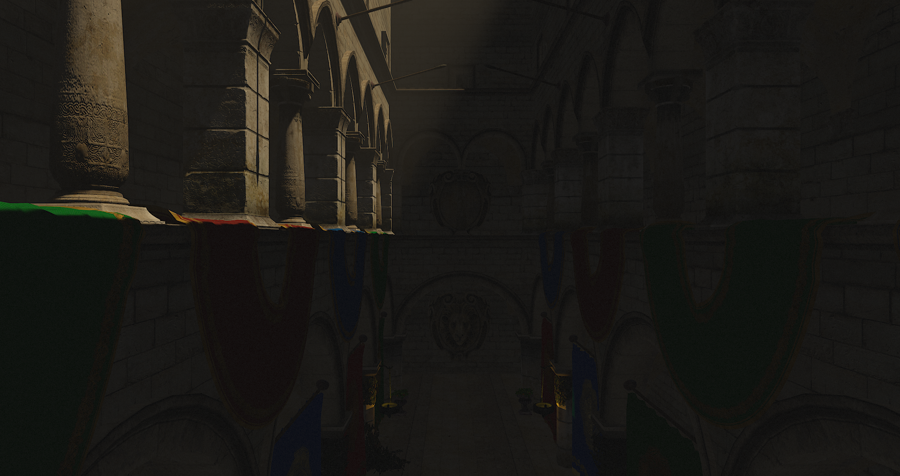
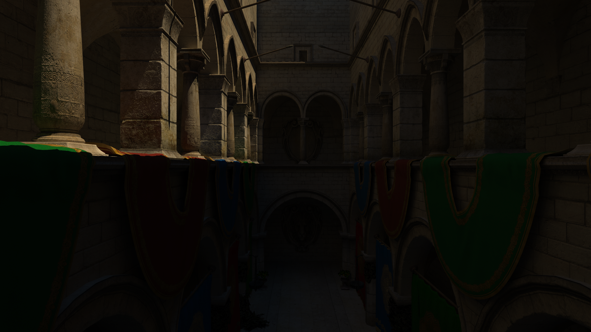

# Atlas Engine

*Rasterized image*

*Ray traced image*
## Introduction
This is a cross platform engine that is available on all major platforms including Linux, Windows and Android.
## Requirements
- OpenGL 4.3 or higher
- OpenGL ES 3.2
## Set up
Before you start compiling make sure to download the dependencies into **./dependencies**. You can either do
this manually or use one of the available scripts. Building the engine is really convenient: You can use your
source code and project across all supported platforms. The only thing that differs are the build tools. 
>**Note:**
>Debugging the resulting application in a debug configuration will result in poor performance. 
### Linux and Windows
The installation is done using CMake. There are two options available: Start a new project with a predefined
main file which you can edit. The second option is two use the engine as a subproject in an already existing project.
#### New project using the engine
After running CMake you can find the main file at **./src/main.cpp**. Just start your project there, it already
contains a main function.
#### Excisting project using the engine
There exist two options:
- You can use the engine as a CMake subproject. Just go ahead and use **add_subdirectory** in the root
CMakeLists.txt of your project. Afterwards add **target_link_libraries(YOUR_TARGET ... AtlasEngine)**. You should be fine.
- You can compile the engine and all dependencies as a static library (note that some dependencies also have
dynamic libraries). Therefore use the **BUILD_LIBRARY** option when using CMake.
### Android
The installation for Android is done differently. You can compile it using Gradle either with or without AndroidStudio.
The Gradle project can be found in **./platform/android**. Open it before you proceed.
There are also two options available: Start a new project with a predefined
main file which you can edit. The second option is two use the engine as a subproject in an already existing project.
#### New project using the engine
You can find the main file at **./src/main.cpp**. Just start your project there, it already
contains a main function. 
#### Excisting project using the engine
There exist two options:
- You can use the engine as a Gradle subproject.
- You can compile the engine and all dependencies as a static library (note that some dependencies also have
dynamic libraries). Therefore set the project property to **BUILD_LIBRARY**.
## Documentation
If you want more information have a look into the [Documentation](https://tippesi.github.io/Atlas-Engine/index.html)
## License
The source code is licensed under the BSD 3-clause license. The license and the copyright notices of the dependencies are found
in the LICENSE file. 
>**Note:**
>The files in the data folder (except the shaders) use a different license. 
## General performance tips
- Use static/stationary objects and lights as often as possible
- Use textures with the same size and format for each material
- Set mesh data or any kind of data prior to rendering. More importantly: Don't create data while rendering.
- Try to avoid using OpenGL, use existing engine features instead
- Reduce the number of samples used for anisotropic filtering (default is the maximum possbile number of samples)
## Code Example
```c
#include "App.h"

std::string Atlas::EngineInstance::assetDirectory = "../data";
std::string Atlas::EngineInstance::shaderDirectory = "shader";

void App::LoadContent() {

	UnlockFramerate();

	renderTarget = new Atlas::RenderTarget(1920, 1080);

	viewport = Atlas::Viewport(0, 0, window.GetWidth(), window.GetHeight());

	auto icon = Atlas::Texture::Texture2D("icon.png");
	window.SetIcon(&icon);
	window.Update();

	font = Atlas::Font("font/roboto.ttf", 88, 10);

	DisplayLoadingScreen();

	camera = Atlas::Camera(47.0f, 2.0f, .25f, 400.0f,
		vec3(30.0f, 25.0f, 0.0f), vec2(-3.14f / 2.0f, 0.0f));

	scene = Atlas::Scene::Scene(vec3(-2048.0f), vec3(2048.0f));

	mouseHandler = Atlas::Input::MouseHandler(&camera, 1.5f, 6.0f);
	keyboardHandler = Atlas::Input::KeyboardHandler(&camera, 7.0f, 6.0f);
	controllerHandler = Atlas::Input::ControllerHandler(&camera, 1.5f, 7.0f, 6.0f, 5000.0f);

	Atlas::Events::EventManager::ControllerDeviceEventDelegate.Subscribe(
		[this](Atlas::Events::ControllerDeviceEvent event) {
		if (event.type == AE_CONTROLLER_ADDED) {
			useControllerHandler = true;
		}
		else if (event.type == AE_CONTROLLER_REMOVED) {
			useControllerHandler = false;
		}
	});

	Atlas::Events::EventManager::KeyboardEventDelegate.Subscribe(
		[this](Atlas::Events::KeyboardEvent event) {
		if (event.keycode == AE_KEY_ESCAPE) {
			Exit();
		}
	});

	sponzaMesh = Atlas::Mesh::Mesh("sponza/sponza.dae");
	sponzaActor = Atlas::Actor::StaticMeshActor(&sponzaMesh, scale(mat4(1.0f), vec3(.05f)));

	directionalLight = Atlas::Lighting::DirectionalLight(AE_STATIONARY_LIGHT);

	directionalLight.direction = vec3(0.0f, -1.0f, 0.1f);
	directionalLight.ambient = 0.05f;
	directionalLight.color = vec3(253, 194, 109) / 255.0f;

	// Shadow mapping that is fixed to a point
	mat4 orthoProjection = glm::ortho(-100.0f, 100.0f, -70.0f, 120.0f, -120.0f, 120.0f);
	directionalLight.AddShadow(200.0f, 0.01f, 4096, vec3(0.0f), orthoProjection);
	directionalLight.GetShadow()->sampleCount = 1;
	directionalLight.GetShadow()->sampleRange = 1.5;
	directionalLight.AddVolumetric(renderTarget->GetWidth() / 2, renderTarget->GetHeight() / 2, 20, -0.5f);

	pointLight0 = Atlas::Lighting::PointLight(AE_STATIONARY_LIGHT);
	pointLight0.location = vec3(24.35f, 6.5f, 7.1f);
	pointLight0.color = 2.0f * vec3(255.0f, 128.0f, 0.0f) / 255.0f;
	pointLight0.AddShadow(0.0f, 512);

	pointLight1 = Atlas::Lighting::PointLight(AE_STATIONARY_LIGHT);
	pointLight1.location = vec3(24.35f, 6.5f, -11.0f);
	pointLight1.color = 2.0f * vec3(255.0f, 128.0f, 0.0f) / 255.0f;
	pointLight1.AddShadow(0.0f, 512);

	pointLight2 = Atlas::Lighting::PointLight(AE_STATIONARY_LIGHT);
	pointLight2.location = vec3(-31.0f, 6.5f, 7.1f);
	pointLight2.color = 2.0f * vec3(255.0f, 128.0f, 0.0f) / 255.0f;
	pointLight2.AddShadow(0.0f, 512);

	pointLight3 = Atlas::Lighting::PointLight(AE_STATIONARY_LIGHT);
	pointLight3.location = vec3(-31.0f, 6.5f, -11.0f);
	pointLight3.color = 2.0f * vec3(255.0f, 128.0f, 0.0f) / 255.0f;
	pointLight3.AddShadow(0.0f, 512);

	scene.Add(&sponzaActor);
	
	scene.Add(&directionalLight);

	scene.Add(&pointLight0);
	scene.Add(&pointLight1);
	scene.Add(&pointLight2);
	scene.Add(&pointLight3);

}

void App::UnloadContent() {

	delete renderTarget;

}

void App::Update(float deltaTime) {

	if (!useControllerHandler) {
		mouseHandler.Update(&camera, deltaTime);
		keyboardHandler.Update(&camera, deltaTime);
	}
	else {
		controllerHandler.Update(&camera, deltaTime);
	}

	camera.UpdateView();
	camera.UpdateProjection();

	scene.Update(&camera, deltaTime);

}

void App::Render(float deltaTime) {	
	
	viewport.Set(0, 0, window.GetWidth(), window.GetHeight());
    
	masterRenderer.RenderScene(&viewport, renderTarget, &camera, &scene);
	
	float averageFramerate = Atlas::Clock::GetAverage();

	std::string out = "Average " + std::to_string(averageFramerate) + " ms  Currently " + std::to_string(deltaTime) + " ms";

	masterRenderer.textRenderer.Render(&viewport, &font, out, 0, 0, vec4(1.0f, 0.0f, 0.0f, 1.0f), 2.5f / 10.0f);

}

void App::DisplayLoadingScreen() {

	float textWidth, textHeight;
	font.ComputeDimensions("Loading...", 2.5f, &textWidth, &textHeight);

	window.Clear();

	auto screenSize = GetScreenSize();

	auto x = (float)window.GetWidth() / 2.0f - textWidth / 2.0f;
	auto y = (float)window.GetHeight() / 2.0f - textHeight / 2.0f;

	masterRenderer.textRenderer.Render(&viewport, &font, "Loading...", x, y, vec4(1.0f, 1.0f, 1.0f, 1.0f), 2.5f);

	window.Update();

}

Atlas::EngineInstance* GetEngineInstance() {

	return new App();

}
```
#### Copy constructors/assignment operators and graphic API objects
There are several classes which represent an easy interface to handle graphic API objects and content on the graphics card. These classes are Shader, ShaderStage, Mesh, Textures (Texture2D, ...), Framebuffer, etc. Now you might ask what happens when you use copy
constructors or assignment operators on these classes. To put it simply: Everything is being copied. When I was developing these methods
I asked myself when I wanted to use a copy constructor or an assignment operator. My answer to that question was that you only wanted to use these methods when you want a copy of the object. Or the other way around: When you don't want a copy you can always use a reference. Let's have an example:
```c
// One common example would be that we want to pass a mesh as a function parameter.
// This is what you shouldn't do if you don't want to create a copy of the mesh:
void DoSomeStuffWithAMesh(Mesh mesh) {
	
}

// Use a reference instead to make sure the object isn't being duplicated:
void DoSomeStuffWithAMesh(Mesh &mesh) {

}


// Let's go a step further:
void AddStuffToScene(Scene* scene, Mesh mesh) {
	for (int32_t i = 0; i < 100; i++)
		scene->Add(new StaticMeshActor(mesh));
	// Store the mesh somewhere to keep it in memory.
}
// Is using a copy constructor
auto mesh = Mesh();
// The following is really bad because the scene uses the pointer to the
// meshes to sort them properly. Because we're creating a new mesh for every
// call there are now 100 meshes in the scene
for (int32_t i = 0; i < 100; i++)
	AddStuffToScene(&scene, mesh);
	
// Let's try it again:
void AddStuffToScene(Scene* scene, Mesh& mesh) {
	for (int32_t i = 0; i < 100; i++)
		scene->Add(new StaticMeshActor(mesh));
	// Store the mesh somewhere to keep it in memory.
}
// Even better would be Mesh mesh(args);
auto& mesh = Mesh();
for (int32_t i = 0; i < 100; i++)
	AddStuffToScene(&scene, mesh);
```
Please note that classes like the actors contain a pointer to the classes presented above. When using an assignment operator on an actor the mesh isn't copied, but the pointer to that mesh is.
#### Thread safety
Most classes are not designed to be used across different threads by default. These classes have to be protected by you as the user. But there are also classes which are known to be used in several threads. These classes are the EventManager, EventDelegate, Time, AudioManager, AudioStream and AssetLoader. They can all be savely accessed by multiple threads. Note that all methods which are static e.g. OpaqueRenderer::AddConfig(...) are always thread safe.
